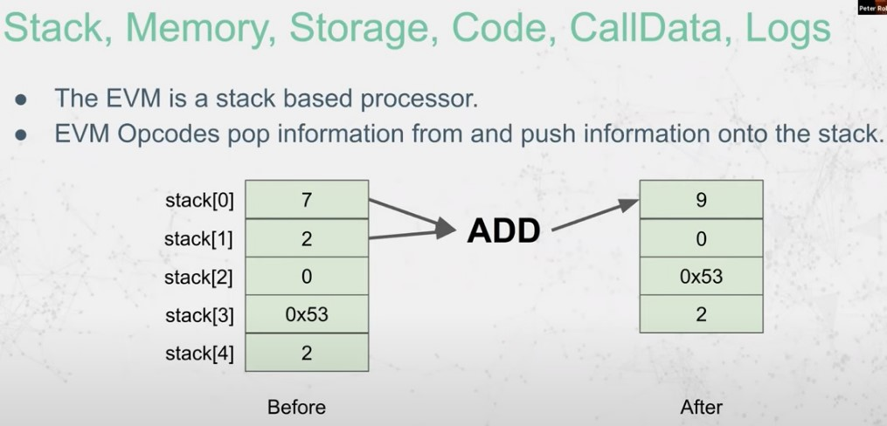
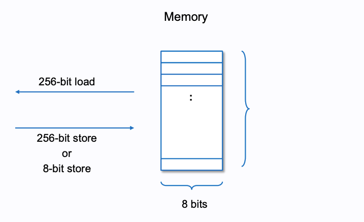
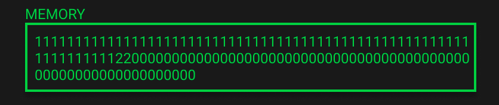
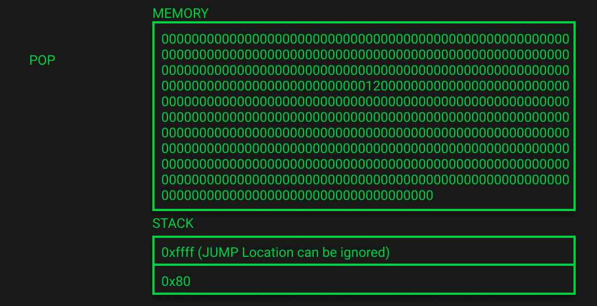

# EVM

## BASICS



The Ethereum Virtual Machine (EVM) is a computation engine that executes smart contracts on EVM-compatible blockchains using a stack-based architecture and a turing-complete instruction set.

EVM does use several data regions:

### Data Region - The Code

_Note: basic computer equivalent = .CODE/.TEXT segment_

In the Code region, the instructions of the smart contracts are defined. Almost all of those instructions are taking their parameters from another data region: the Stack.

EVM does use its own instructions, which are defined here: https://www.evm.codes/

### Data Region - The Program Counter

_Note: basic computer equivalent = EIP register_

The Program Counter is used to encode which instruction should be next executed. It points to the code section.

### Data Region - The Stack

_Note: basic computer equivalent = stack segment_

In EVM, the stack is a list of 32-byte element. Each call has its own stack, which is destroyed when the call context ends.

The stack does follow a LIFO structure (Last-In First Out).

### Data Region - The Memory

_Note: basic computer equivalent = heap segment_

The memory region is not persistent, it is also destroyed at the end of the call context.

Memory is accessible using `MSTORE` and `MLOAD` instructions.

### Data Region - The Storage

_Note: basic computer equivalent = data segment, but always persistent for each execution of contract_

This is a map of $2^{256}$ slots of 32-byte values. It is the persistent memory of contracts.

Storage is accessible using `SSTORE` and `SLOAD` instructions.

### Data Region - The Calldata

_Note: basic computer equivalent = argc/argv, but instead of commandline, it is transaction_

This is the data sent to a smart contract through a transaction. The function selector will be in this calldata.

This calldata is accessible using `CALLDATALOAD`, `CALLDATASIZE` and `CALLDATACOPY`.

### Data Region - The return data

_Note: basic computer equivalent = return value_

This is the data returned from a smart contract once execution is done.

A contract access to it using `RETURN` or `REVERT` instructions. It can be read from a calling contract through `RETURNDATASIZE` and `RETURNDATACOPY`.

<br>
<br>

## CONTRACT CREATION CODE

**Key Concepts:**

- Deployment data layout: `<init code> <runtime code> <constructor parameters>` (as a convention). Together they’re called the **creation code;**
- Init code is executed first, storing runtime code on the blockchain;
- `creationCode`: Retrieves bytecode for deployment, excluding constructor arguments.

<br>

_Example._ Retrieving creationCode:

```solidity
contract GetCreationCode {
    function get() external pure returns (bytes memory) {
        return type(ValueStorage).creationCode;
    }
}
```

### INIT CODE Breakdown

#### Payable Constructor Example:

- Init Code: `(0x)6080604052603f8060116000396000f3fe`
- Process:
  - Allocate memory;
  - Copy runtime code;
  - Return runtime code for storage.

#### Non-Payable Constructor Example:

- Init Code: Contains additional 12 bytes to handle wei checks and revert if necessary;
- Wei Check Opcodes:
  - Verify no wei sent: `CALLVALUE`, `ISZERO`, `REVERT`.

#### Key Differences:

- Payable Offset: 0x11;
- Non-Payable Offset: 0x1d (12-byte adjustment).

<br>
<br>

### RUNTIME CODE Breakdown

#### Runtime code for an empty contract

- Even an empty contract has non-empty runtime code due to compiler-added metadata;
- Solidity appends metadata to runtime code, with an INVALID opcode (fe) prepended to prevent execution;
- From Solidity 0.8.18, `--no-cbor-metadata` prevents metadata addition;
- Pure Yul contracts do not include metadata by default unless explicitly added.

<br>

Example Yul contract copies and returns runtime code without metadata:

```julia
// The output of the compilation of this contract will have no metadata by default

object "Simple" {
 code {
     datacopy(0, dataoffset("runtime"), datasize("runtime"))
     return(0, datasize("runtime"))
 }

 object "runtime" {

     code {
         mstore(0x00, 2)
         return(0x00, 0x20)
     }
 }
}
```

Compilation output: `6000600d60003960006000f3fe`.

#### Non-Empty Contract Runtime Code

Adding minimal logic to a contract changes the runtime and metadata:

```solidity
pragma solidity 0.8.7;

contract Runtime {
    address lastSender;
    constructor () payable {}

    receive() external payable {
        lastSender = msg.sender;
    }
}
```

- Constructor arguments are ABI-encoded and appended to creation code;
- Solidity ensures parameter length matches expectations, reverting if not;
- Runtime code, metadata, free memory pointer, and constructor argument are organized in memory before the `RETURN` opcode executes;
- Metadata resides in unexecutable sections.

<br>

**<u>Steps in Constructor Handling:</u>**

**1.** Initialize Free Memory Pointer

- Standard initialization using 6080604052.

**2.** Calculate Parameter Length

- Use CODESIZE and subtraction to determine appended parameter length.

**3.** Copy Constructor Parameters

- Use CODECOPY to place parameters in memory.

**4.** Update Free Memory Pointer

- Adjust pointer after copying parameters.

**5.** SSTORE Execution

- Store parameter in contract storage (e.g., slot 0).

**6.** Validate Parameter Size

- Ensure parameter is at least 32 bytes, reverting otherwise.

**7.** Return Runtime Code

- Copy runtime code to memory and return it.

<br>
<br>

## CHOOSING A FUNCTION SELECTOR

**Key Concepts:**

- Code-to-Interpretation Flow: `Solidity → Yul → Bytecode (Runtime) → Opcodes`;
- Opcodes = 1 byte long, approximately 250 opcodes;
- Function selectors are the first 4 bytes of the Keccak-256 hash of a function's canonical representation (e.g., store(uint256) → 6057361d);
- Calldata includes:
  - The 4-byte function selector,
  - 32-byte arguments.

### Function Selector Logic in Bytecode

1. Extracts the selector by shifting the first 4 bytes of calldata;
2. Compares the selector with predefined selectors in the bytecode using opcodes like `EQ`;
3. Uses conditional jumps (`JUMPI`) to move to the corresponding function's bytecode location.

<br>

_Example:_

For `store(10)`, calldata is:
`6057361d000000000000000000000000000000000000000000000000000000000000000a`

- `6057361d`: Function selector for `store(uint256)`.
- `000...0a`: Encoded argument (10).

The bytecode checks the selector and jumps to the correct location in the program.

<br>

**Key Opcodes in Function Selection:**

- `PUSH1`, `PUSH2`, `PUSH4`: Push byte-specific (1/2/4 bytes of data) data onto the stack;
- `CALLDATALOAD`: Load calldata at a specified offset;
- `SHR`: Bit-shift data to isolate the function selector;
- `JUMPI`: Conditionally jump to a function's bytecode based on selector match.

<br>
<br>

## MEMORY DATA STRUCTURE

Contract memory is a simple byte array, where data can be stored in 32 bytes (256 bit) or 1 byte (8 bit) chunks and read in 32 bytes (256 bit) chunks.



Here are the three most essential opcodes for working with memory:

- MSTORE (x, y) - starting at memory location “x” store a 32 byte (256-bit) value “y” ;
- MLOAD (x) - load 32 bytes (256-bit) starting at memory location “x” onto the call stack;
- MSTORE8 (x, y) - at memory location “x” (the least significant byte of this OFFSET) store a 1 byte (8-bit) value “y”.

> **MSB vs. LSB:** The EVM uses **big endian byte ordering** for instructions, memory, and input data.
>
> `0x1234567890abcdef`:
>
> - The LSB is `0xef`;
> - The MSB is `0x12`.

[EVM Playground](<https://www.evm.codes/playground?unit=Wei&codeType=Mnemonic&code=%27Vg*(_I...1W0GJ_!!!!z00FK22WJQ0Y22z20F8K33W33Q1Y33z21F8d(v0Z0-Jq00Xd(vJZJ-64q20Xdv33Z33-65q21Xpp%27~N%20locatioCzG1_wppVv7o7hBcall%20stack%20from~uIIIIq(%20ofNzp%5Cnj%20bytegSTOREdw)*_%200xZ9BY9Chex%7DzXpM)W%20at~V%2F%2F%20MQ%20%7B0x2N%20memoryKwg8%201j_J32I11GpPUSHFpMgCn%20Be%209%20i7%20t*%20J)LOAD(js!uu%01!()*79BCFGIJKNQVWXYZ_dgjpquvwz~_>)

### Memory Expansion

- An additional memory expansion cost for writting to untouched memory area;
- Memory expands in 32-byte increments when writing to a new memory area;

> Memory expansion costs scale linearly for the first 724 bytes and quadratically after that.



> Remember memory is a **byte array** meaning we can start our reads (and our writes) from any memory location. We are not constrained to multiples of 32. Memory is linear and can be addressed at the byte level.

### The Free Memory Pointer

The first 5 bytes of a contract runtime bytecode present the initialization of the “free memory pointer”:
`6080604052`:

60 80 = `PUSH1` 0x80
60 40 = `PUSH1` 0x40
52 = `MSTORE`

```
0000000000000000000000000000000000000000000000000000000000000000
0000000000000000000000000000000000000000000000000000000000000000
0000000000000000000000000000000000000000000000000000000000000080
```

- A pointer to the location where free memory starts;
- When a variable is written to memory, the contract:
  - References the free memory pointer for available space;
  - Updates the pointer to reflect the new memory boundary: `freeMemoryPointer + dataSizeBytes = newFreeMemoryPointer`.

### Bytecode

- Solidity reserves specific memory slots:
  - `0x00`–`0x3f` (64 bytes): Scratch space (can be used between statements i.e. within inline assembly and for hashing methods);
  - `0x40`–`0x5f` (32 bytes): Free memory pointer (start location of free memory);
  - `0x60`–`0x7f` (32 bytes): Zero slot (used as an initial value for dynamic memory arrays and should never be written to).

### Memory in a Real Contract

```solidity
contract MemoryLane {
    function memoryLane() public pure {
        bytes32[5] memory a;
        bytes32[2] memory b;
        b[0] = bytes32(uint256(1));
    }
}
```

[EVM Playground](<https://www.evm.codes/playground?unit=Wei&callData=0xd275ca72&codeType=Mnemonic&code=%27BBQFreXM%3APointer%20%C2%8B~_BB_QvaluXto%20storXfor%20NG80)128%3F%2480Qlocatio9for%20NG40)64%3F%C2%8EQjump!9%7Brequired%20to%20prevent%20stack%20underflow%7D%20_PUSH2Gffff___BBB~~~%C2%83a%7F%2F_BBB~~~_Qload%20N%2440_MLOAD_%23N_DUP1Q0xa0)160%3F%2C%2032%20*%205)160%20first%C2%8C5%24a0QN(0x8%C2%82a0%7D)new%20N_ADDQSavXthis%20new%20valuX0x120%20to%20thXfreXmemory!n%C2%8E_BB%2FQM%3A%C2%8BVaraiblX%E2%80%9Ca%E2%80%9D%20~%2F_BB%2F_%230x80_DUP1QpushG05)5%3F(array%20length%7D%2405QSwap%20thXtop%202-tems%20%C2%86andG80_SWAP1QpushG20)32%C2%88e%7D%2420QDuplicatXthX3rd%3B%C2%86to%20thX%C2%84_DUP3Q0x05%20*G20)5%20*%2032-9decmial)160%20o9%C2%84(sizXof%20array-9bytes%7D_MULQDuplicatX0xa0)160%3F_DUP1QReturns%20sizXof%20calldata-9bytes%20currently%20just%C2%90%3DG04%20or%204-9decmial%C2%89stack(0x80%7D_DUP4Q0x80(%7CXcopie%40Ga%C2%8A_Qthis%20offsets%20thX4%20bytes-9our%20call%20data%20with%20a%20sizXofGa0%20which%20yeild%20a%20160%20bit%20set%20of%200%22s%20to%20bXstored%20at%20thXN!n_Qthis%20effectively-nitialises%20our%20array-9m%3A%C2%87%60%C2%80%25eded_%230xa0_DUP1%230x80_DUP3Qnew%20N%20as%20before_ADDQswap%201st(0x120%7D%3Bo9%3E%20and%203rd(0x80%7D_SWAP2K80%7D_POPKa0%7D_POPQS%C2%81120%20%26G05_SWAP1K05%7D_POPK120%7D_POPQs%C2%8180%20%26Gb6(jump!n%7D_SWAP1%C2%8D%5E%C2%85%C2%85%C2%8D%2C%5E_BBB~~%2F%C2%83b%7F_BBB~~%2F_QN%20load-9%2440_MLOAD%23N(0x120%7D_DUP1Q0x40)64%3F%2C%2032%20*%202)64%20second%C2%8C2%2440QN(0x12%C2%8240%7D)new%20N_ADDQsavXnew%20N%20valuXat%20freXmemory!nG40%C2%8EBBQM%3A%C2%8BVariablX%E2%80%9Cb%E2%80%9D%20~_BB_%230x120(m%3Astart!9for%20variablX%5C%27b%5C%27%7D_DUP1Q0x02)2%3F)array%20length%2402Qs%C2%8102%20%26G120_SWAP1Q0x20)32%C2%88Xi9bytes%7D%2420%233rd%3Bo9%3EG02_DUP3Q0x02%20*G20%20%3DG40)64(amount%20of%20bytes-9m%3Ato-nitialise%7D_MUL%230x40(N!n%7D_DUP1QsamXas%20beforX4%20bytes%20for%C2%900x04%C2%89%3E%20%3DG120_DUP4Q0x120(%7CXcopie%40G4%C2%8A%C2%87%60%C2%80%25eded__~duplicatXthX%C2%84G40_DUP1%233rd%3Bo9%3EG120_DUP3Qadd%20together%20yields%20N%20value_ADDQswapG160%20%26G120_SWAP2K120%7D_POPK40%7D_POPQswapG160%20%26G02_SWAP1K02%7D_POPK160%7D_POPQjump!9to%20%C2%84Gbe_SWAP1QsimulatXjump%20pop%20jump!9off%20stack_POP__B~~~QAssig9ValuXto%20b%5B0%5D%20~_B~~~_QpushG01%2C%20valuXto%20add%20b%5B0%5D%2401QpushG00%2400Qleft%20shift%20operatio9no%20shift%2C%20first-nput-s%200%20_SHL%C2%91120%7D_DUP2QpushG00)%5B0%5D%20wherXi9thXarray%20should%20this%3Bgo%2400QpushG20)64%20bytes%20thXlength%20of%20thXarray%20%2402%C2%9100%7D_DUP2Q0x00%20%3CG20)%20truX%3DG01(check%20thXuser-s%20not%20trying%20to%20storXa%20valuXat%20a!9that%20doesn%22t%20exist-9thXarray%7D_LTQjump!n_PUSH2G00d7Q2%20POPs%20sincXthis-s%20a%20JUMPI(checking-f%20LT%20returned%20truXor%20false%7D%C2%8F%C2%8F_QpushG20(32%20bytes%20aray%3Bsize%7D%2420Q0x20%20*G00%20%3DG00)0%C2%88X*-ndex%20to%20determinXbytXoffset%7D_MULQ0x00%20%2BG120_ADD%232nd%20o9stackG01(valuXfor%20b%5B0%5D%7D_DUP2%232nd%20o9stackG120(memory!9for%20b%5B%5D%7D_DUP2QstorX0x01%20at%20memory!nG120_MSTOREQclea9up%20stack_POP_POP_POP_POP_%27~%2F%2F_%5CnXe%20Q_~%20NfreXm%3ApointerKQpop%20top%3Boff%20stack(0xG%200xB~~~~~~~~~~9n%20-%20i)%20%3D%20(%20%7B!%20locatio%23QduplicatX%24_PUSH1G%25%5C%27a%5C%27%20and%20removes%20any-tems%20that%20arXno%20longer%20ne%3Aemory%20%3B-tem%20%3EthXstack%3F-9decimal%40d.%7D%2CG04(bytXoffset-9thXcalldata%20to%20copy.%7D%2C%5E%20removXthXtop%3Boff%20stack%20with%20POP_POP_%60ng%20lines-9this%20sectio9manipulatX%3E%20to%20%7CbytXoffset-9thXm%3AwherXthXresult%20will%20b%7F%E2%80%9D%20%26%20FreXM%3APointer%20UpdatX~%C2%80ensurXwXhavXthXmemory!9of%20variablX%C2%81wap%20top%202-temsG%C2%820%7D%20%2B%20spacXfor%20array(0x%C2%83QM%3AAllocatio9VaribalX%E2%80%9C%C2%84top%20of%20%3E%C2%85QSimulated%20jump!n_PUSH2Gffff%C2%86o9%3E-9this%20casX0x05%20%C2%87_CALLDATACOPY_QThXremaini%C2%88%3F(array%3Bsiz%C2%89_CALLDATASIZE%234th%3Bo9%C2%8A0(bytXsizXto%20copy.%7D%C2%8BInitialisatio9%C2%8C%20array-s%20length%20%C2%8DQsimulating%20a%20JUMP%C2%8E%2440_MSTORE__%C2%8FQsimulatXJUMPI%20_POP%C2%90%20functio9signaturX%C2%91%232nd%3Bo9stack(0x%01%C2%91%C2%90%C2%8F%C2%8E%C2%8D%C2%8C%C2%8B%C2%8A%C2%89%C2%88%C2%87%C2%86%C2%85%C2%84%C2%83%C2%82%C2%81%C2%80%7F%7C%60%5E%40%3F%3E%3B%3A%25%24%23!()-9BGKNQX_~_>)

1. Free memory pointer initialization
2. Next memory is allocated for variable `a` (bytes32[5]) and the free memory pointer is updated.

   > Remember elements in memory arrays in Solidity always occupy multiples of 32 bytes (this is even true for bytes1[], but not for bytes and string)

   - The **size of the array multiplied by 32 bytes** tells us how much memory we need to allocate;
   - This returns `0x120` (288 in decimal) which we can see has been written to the free memory pointer location.

3. Variable `a` has been initialized in memory.

- To do this write the EVM uses `CALLDATACOPY` which takes in 3 variables:
  - `memoryOffset` (which memory location to copy the data to)
  - `calldataOffset` (byte offset in the calldata to copy)
  - `size` (byte size to copy)



4. Variable `b` Memory Allocation & Free Memory Pointer Update.
5. Variable `b` has been initialized in memory.

   - Memory has increased to 352 bytes.

6. Assign Value to `b[0]`:
   - Push the values, which should be written, onto the stack;
   - Where in memory the value needs to be written: `0x20 (32 in decimal) * 0x00 (0 in decimal) = 0x00`;
   - The start location of an array index: `0x00 + 0x120 = 0x120 (288 in decimal)`;
   - `MSTORE`.

<br>
<br>
