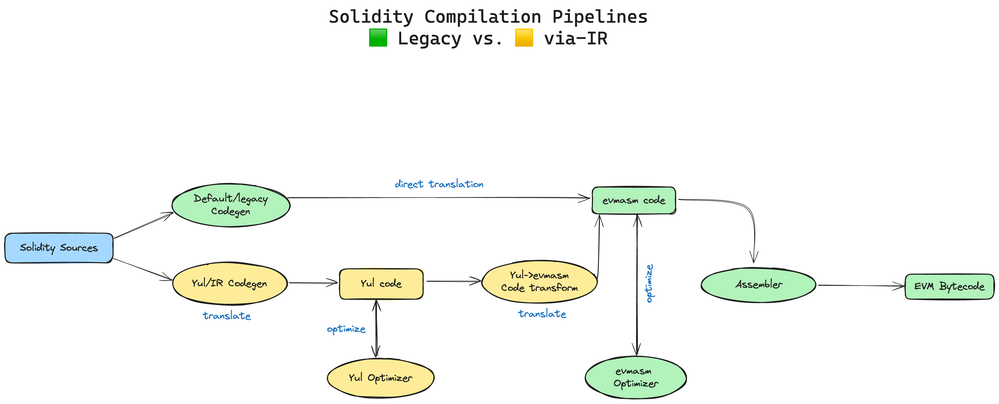

# Solidity

## VIA-IR COMPILATION

### Default Compilation

1. The compiler takes each Solidity smart contract source code as input and parses the source files;
2. The compiler then analyzes the source code and generates the **EVM assembly** directly using the legacy codegen;
3. It then runs the optimizer on the code until the code is considered sufficiently optimized;
4. Finally, the compiler generates bytecode for each contract.

### via IR Compilation

1. The compiler parses the Solidity source files;
2. Instead of compiling Solidity source code directly to **EVM assembly**, the new IR code generator will first transform the Solidity code into Yul code;
3. The **Yul optimizer** will repeatedly perform optimizations on the Yul code;
4. The optimized Yul code is then transformed into **EVM assembly** using **Yul → evmasm** code transform;
5. This code is very close to the actual bytecode, but is still suitable for further optimizations by the evmasm optimizer;
6. Finally, the EVM bytecode is generated.

### Motivation

- Allow more powerful optimizations;
- Generate a more optimized bytecode;
- Reduce gas costs;
- Enable better security audits;
- Reduce stack too deep errors.

  #### Yul Advantages

  1. Enables more efficient manual inspection, formal verification, optimization of the code;
  2. Allows greater control over Solidity (e.g. retaining/allocating memory/storage knowledge);
  3. Ease of complex adjustments for various layer 2 extensions;
  4. Can serve as a backend for various compilers, for instance, for Fe;
  5. **EOF upgrade** compatibility.

### Disadvantages

- Longer compilation times;
- Unconditionally can generate code for every expression without codegen shortcuts → IR code becomes more verbose, inefficient. Yul optimizer compensates for this.

 
 
