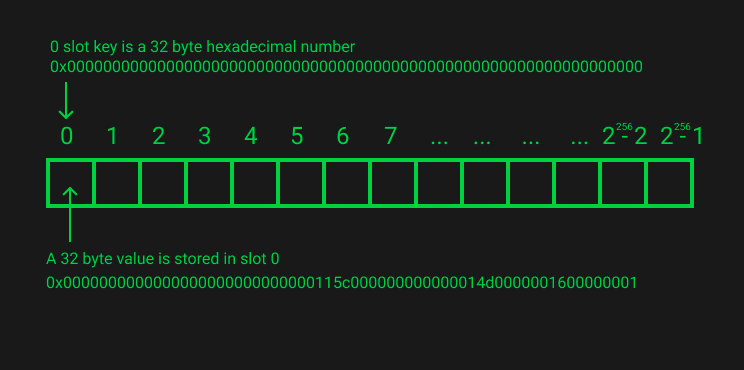
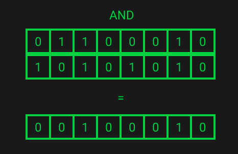

# Storage

## Overview

- A key to value mapping;
- All values are initialised as 0 and zeros are not explicitly stored;
- 2<sup>256</sup> is approximately the number of atoms in the known, observable universe. No computer can hold that much data. This is the reason setting a storage value to zero **refunds** you some gas as that key value no longer needs to be stored by the nodes on the network.
- Conceptually storage can be viewed as an astronomically large array.



### Slot Packing


### EVM Storage Opcodes

- `SSTORE`

  - Takes in a 32-byte key and a 32-byte value from the call stack and stores that 32-byte value at that 32-byte key location
  - [EVM Playground](https://www.evm.codes/playground?unit=Wei&codeType=Mnemonic&code=%27z1uFFv1%200w~z2uy8965w%27~%5Cnz%2F%2F%20Example%20yv2%20w~SSTORE~v~PUSHuy0xFF%01uvwyz~_)

- `SLOAD`
  - Takes in a 32-byte key from the call stack and pushes the 32-byte value stored at that 32-byte key location onto the call stack
  - [EVM Playground](https://www.evm.codes/playground?unit=Wei&codeType=Mnemonic&code=%27wSet%20up%20thrstatez46z0~SSTOREy1z0vy2z1v~%27~%5Cnz~PUSH1%20y~~wExamplrw%2F%2F%20v~SLOADre%20%01rvwyz~_)

> `SLOAD` & `SSTORE` only deal in 32-byte chunks.

### Storing & Retrieving Packed Variables

```solidity
contract StorageTest {
    uint32 value1;
    uint32 value2;
    uint64 value3;
    uint128 value4;

    function store() public {
        value1 = 1;
        value2 = 22;
        value3 = 333;
        value4 = 4444;

        uint96 value5 = value3 + uint32(666);
    }
}
```


Slot packing makes use of 3 bitwise operations:

- `AND`: comparison on 2 byte values searching for equality;



- `OR`: only one of the values needs to have a value of 1 for the statement to return true;


- `NOT`: only takes in one value rather than performing a comparison on 2 . NOT performs logical negation on each bit. Bits that are 0 become 1, and those that are 1 become 0.;


### Slot Manipulation - Slot Packing SSTORE

We'll focus on: `value2 = 22;`


Bitwise `OR` in practice:


### Slot Manipulation - Retrieving a Packed Variable SLOAD

We'll focus on: `uint96 value5 = value3 + uint32(666)`


[EVM Playground](<https://www.evm.codes/playground?unit=Wei&codeType=Mnemonic&code=%27qjjjj.17%20-F1)%201%3C~J1_01J1_00~DUP1%224_%244_*jjjj-.18%20-F2)%2022%3C-~~J1_16Gvalue2)%2022%20decimal)_16%20i(hex%C2%81storagQlocatio(forF2%5C%27~J1_04G4%602%5C%27~J2_0100G0x100%20i(hex)%20256%20i(decimal%2C%202%23_04)_1%3F%5D%5D%20~%5D%20~DUP2Gduplicate_00C%3A%40DUP2GduplicatQ%7F_04)_1%3F%5B%5D%5D~~MULGmultiplyCo%20geB%25for%3E~~NOTGNOT%20operationCo%20geB%25for%20allYexcept%3E~~ANDGAND%20of%20%25and%20sloB0!Qto%20zero%20ouBvalues%20in%3E%20and%20retai(all%20other!es~~%7C1%3F%C2%80DUP4GduplicatQvalue2!Q%3D%2022)_16%5B%20~~ANDGANDCo%20ensurQthQvaluQis%20no%20morQtha(4Yi(length~~MULGreturns!e2%20atChQcorrecBpositio(-%204Yin~~ORGOR%20with%20previous!QandChQvaluQAND%20yielded%20o(linQ38%20gives%20usChQ32YthaBneedCo%20bQstored~~SWAP1GsloB0%C2%80SSTOREGstorQthQ32%20bytQvaluQaBsloB0~~POPGpop_16%20offChQstack~~qjjjj--.19%20-F3)%20333%3C--~J2_014dJ1_00J1_08%228_K%248_K*jjjj---.20%20-F4)%204444%3C---~J2_115cJ1_00J1_10%2216_KKK%2416_KKK*jjjjjjj--.22%20-%20%5C%27uint64!e5)!e3%20%2B%20%5E%3Cjjj--~~J1_00~J2_029aG%5E%5B~~ANDGensurQ%5E%20does%20noBexceed%208%20bytes%2CCrim%20if%20iBdoes%20%C2%81locatio(of!e3~J1_08G8%603%5C%27~~%7C00C%3A%20for%20SLOAD%20of%20sloB0%40%7C08C%3A%20for%20EXP~J2_0100G2%23_08)_1%3F%3F~~SWAP1GgeBsloB0!Qt%3A~~DIVGDIV%20of%20sloB0!Qwith_1%3F%3F%20removQbottom%208Y%20~J8_KKG%258Ylength%20~~ANDGZero%20outYoutsidQofChQ8%20bytQmaskCo%20retur(variablQ%5C%27value3%5C%27~~qTo%20seQthQresBofChQopcodes%20forChis%20calculatio(recreatQthQcontracBi(remix%20and%20enter%20debugging%20mode%27~%5Cnq%2F%2F%20j--------_%200xY%20bytes%20Qe%20KffffffffJ~PUSHG%20qF%20%5C%27valueC%20tBt%20.~qSolidity%20LinQ*K~AND~MUL~OR~SWAP1~SSTORE~POP~~q)%20%3D(n%20!%20valu%22J2_0100~EXP~DUP2~SLOAD~DUP2J%2356%20bits%20i(1%20bytQ~~EXPG%7F%24K~MUL~NOT~AND~SWAP1~DUP4J%25bitmask%20%3AoCop%20of%20stack%3C%3B%5C%27~qjjjj%3EChQ8YassignedCoF2%5C%27%3F00000000%40~~SLOADGload%20data%20aBsloB0~~%5B~J4_KG%254Ylength%5D%20%20%20%5Euint32%7B666%7D%60Yi(-%20starBpositio(forF%7CSWAP1Gbring_%7FexponenBof_0100%20%26%C2%80CoCop%20ofChQstack~~%C2%81~J1_00GsloB0%20-%20%01%C2%81%C2%80%7F%7C%60%5E%5D%5B%40%3F%3E%3C%3A%25%24%23%22!()*.BCFGJKQY_jq~_>)

<br>
<br>
